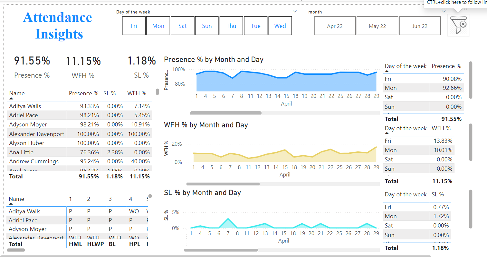

# HR_analytics
#  Summary

## Attendance Insights Dashboard

### Overview
This dashboard provides a comprehensive analysis of employee attendance, work-from-home (WFH) percentages, and sick leave (SL) percentages for the month of April. The data is segmented by individual employees, days of the week, and aggregated totals.

### Key Metrics
- **Presence %:** 91.55%
- **WFH %:** 11.15%
- **SL %:** 1.18%

### Detailed Breakdown

#### Individual Employee Data
- **Aditya Walls:** 
  - Presence: 93.33%
  - WFH: 7.14%
  - SL: 0.00%
- **Adriel Pace:** 
  - Presence: 98.21%
  - WFH: 5.45%
  - SL: 0.00%
- **Adyson Moyer:** 
  - Presence: 98.21%
  - WFH: 10.91%
  - SL: 0.00%
- **Alexander Davenport:** 
  - Presence: 100.00%
  - WFH: 100.00%
  - SL: 0.00%
- **Alyson Huber:** 
  - Presence: 100.00%
  - WFH: 0.00%
  - SL: 0.00%
- **Ana Little:** 
  - Presence: 76.36%
  - WFH: 0.00%
  - SL: 2.38%
- **Andrew Cummings:** 
  - Presence: 95.24%
  - WFH: 40.00%
  - SL: 0.00%

#### Day of the Week Analysis
- **Presence %:**
  - Friday: 90.08%
  - Monday: 92.66%
  - Saturday: 0.00%
  - Sunday: 0.00%
  - **Total:** 91.55%
- **WFH %:**
  - Friday: 13.83%
  - Monday: 10.01%
  - Saturday: 0.00%
  - Sunday: 0.00%
  - **Total:** 11.15%
- **SL %:**
  - Friday: 0.77%
  - Monday: 1.72%
  - Saturday: 0.00%
  - Sunday: 0.00%
  - **Total:** 1.18%

### Trends by Month and Day
- **Presence %:** Generally stable with slight fluctuations, maintaining above 80% throughout April.
- **WFH %:** Peaks around mid-April, with a maximum of approximately 20%.
- **SL %:** Minor peaks around early April, with a maximum of approximately 5%.

### Conclusion
The dashboard indicates a high overall presence rate of 91.55%, with a moderate WFH rate of 11.15% and a low SL rate of 1.18%. The data suggests that most employees are present or working from home, with minimal sick leave taken. This information is crucial for understanding workforce availability and planning for resource allocation.
